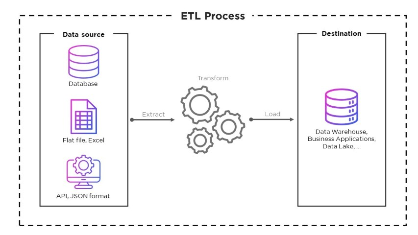
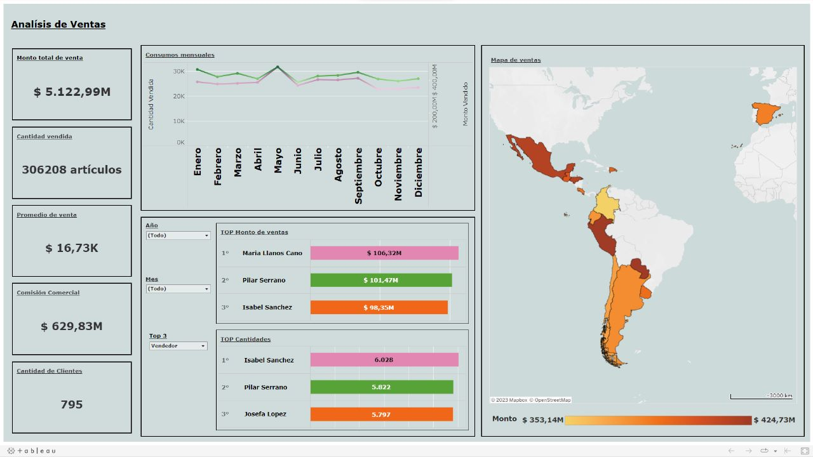

# ***QG Data Process***

Desafio final desarrollado para el el curso de Data Process, brindado por Quales Group (https://qualesgroup.com/).

#
## ***Etapas***

1.  Modelado de los datos según las reglas de negocio. [Imagen](assets\image\Modelado.png)

2.  Creación de tablas de staging en SQL Server. [Tablas](assets\scripts\CREATE_TABLES_STG.sql)

3.  Importación de datos desde un archivo excel a las tablas de staging. [Importar](https://support.microsoft.com/es-es/office/importar-o-vincular-a-datos-en-una-base-de-datos-de-sql-server-a5a3b4eb-57b9-45a0-b732-77bc6089b84e#ID0EBD=Office_2013)
    > Otra opción es agregar los datos a las tablas mediante insert. [Inserts](assets/scripts/INSERTS_INICIALES.sql)
    
    >    Gracias a [Axel Moriena](https://github.com/AxelM1989) por ese script. 
4.  Creación de tablas intermedias [Tablas](assets\scripts\CREATE_TABLES_INT.sql)

5. Store Prosedure para la transformación e inserción de los datos desde las tablas staging. [SP](assets\scripts\STORED_PROCEDURES_INT.sql)

6. Creación de tablas finales de Dimensión y Hechos [Tablas](assets\scripts\CREATE_TABLES_FINALES.sql)

7. Store Procedure para la inserción/actualización de los datos desde las tablas intermedias [SP](assets\scripts\STORED_PROCEDURES_FINALES.sql)

### **_Extra (No fue requerimiento del curso)_**
6. Visualizacion de métricas propuestas. [Dashboard](https://public.tableau.com/views/QG-DataProcess/Mtricas?:language=es-ES&publish=yes&:display_count=n&:origin=viz_share_link)

